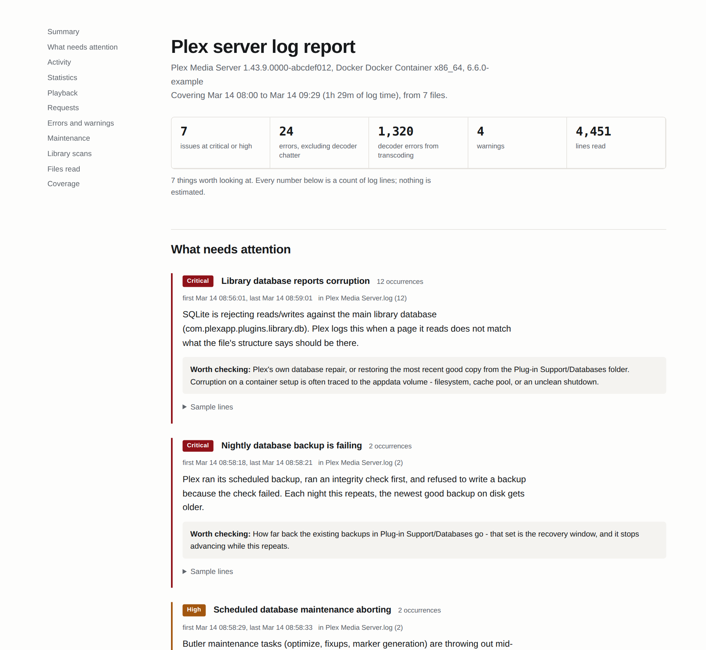

# plexreport

Turns Plex Media Server logs into a readable HTML report — findings ranked by
severity, activity charts, playback and traffic statistics, and errors grouped by
message pattern instead of dumped as a wall of text.

Python 3.8+, standard library only. No pip install, no services, nothing to configure.



## Try it without a server

The repo ships a generator for entirely fictional logs, so you can see the output
before pointing it at anything real:

```bash
python3 examples/make_sample_logs.py examples/sample-logs
python3 plexreport.py examples/sample-logs -o examples/sample-report.html
```

`examples/sample-report.html` in this repo was built exactly that way. It doubles as a
test: the sample deliberately contains one of everything, so all 17 findings rules
should fire and the coverage section should report 0 unparsed lines.

## Running it

```bash
python3 plexreport.py "Plex Media Server Logs.zip" -o report.html
```

It accepts, in any combination:

- the zip from Plex Web (Settings → Manage → Troubleshooting → Download Logs)
- a `Logs` directory, recursed, including `PMS Plugin Logs/`
- individual `.log`, `.log.N` or `.gz` files

### Options

| Option | What it does |
|---|---|
| `-o PATH` | HTML output path (default `plex-report.html`) |
| `--pdf PATH` | also write a PDF, using weasyprint, wkhtmltopdf or headless Chrome — whichever is installed |
| `--json PATH` | machine-readable summary, for trending between runs |
| `--since 24h` | ignore lines older than this: `24h`, `3d`, `2w`, or `2026-09-09` |
| `--top N` | how many message patterns to list (default 40) |
| `--redact` | mask IP addresses, account names and email addresses |

Auth tokens are masked in every run whether you ask or not. `--redact` is the extra
step for anything you're going to post publicly.

The HTML is one self-contained file — no CDN, no external fonts, no JavaScript
beyond a filter box. It works offline, on a phone, and behind a reverse proxy, and
it has a dark mode that follows the OS setting.

### Nightly, on Unraid

```bash
DIR="/mnt/user/appdata/<container>/Library/Application Support/Plex Media Server/Logs"
python3 plexreport.py "$DIR" -o /mnt/user/www/plex/report.html \
        --json /mnt/user/www/plex/summary-$(date +%F).json --since 24h
```

Diffing the `findings` array between two `summary.json` files tells you what started
happening today that wasn't happening yesterday.

## What the report contains

**What needs attention** — a rule table of named conditions, each with an occurrence
count, first and last timestamp, which files it appeared in, what the log line
actually reports, and where to look next. Ranked critical → context.

**Activity** — log lines per hour with the error share drawn in, on a square-root
scale so quiet hours stay visible. Plus confirmed server starts, counted from the
startup sequence rather than the version banner (Plex reprints that banner at the
top of every rotated log, so counting banners over-reports restarts).

**Statistics** — viewing sessions rebuilt from client timeline updates, data served
per hour, requests per hour, response-time percentiles, playback states, live TV
sources, data by client, items added.

**Playback** — transcode session reports from the XML statistics files: user, client,
decision, codec path, hardware encoder, and pacing.

**Requests** — status codes, busiest endpoints, clients, slowest completed requests.

**Errors and warnings** — grouped by normalized message pattern, with decoder chatter
separated out so it doesn't drown everything else.

**Coverage** — which rules fired, which didn't, and the most common line shapes that
matched no format at all.

## Things worth knowing before you read the numbers

**Debug logging.** Request and timeline lines are written at DEBUG level. With debug
logging off, the Requests section and the viewing-session statistics are empty. Empty
means "not logged", not "zero".

**Decoder errors.** Plex logs every ffmpeg decoder complaint at ERROR. On over-the-air
MPEG-2 these run into the tens of thousands and track reception quality, not server
health. They're counted separately from everything else for that reason.

**Transcode pacing.** Each segment's timeline records the wall-clock window the segment
was finished in, and the windows tile the session end to end. A live source arrives in
real time, so about one second of wall per second of media is the ceiling and means the
transcoder never fell behind. Long windows mean the source stopped feeding — the
encoder is idle during those, not overloaded.

**Long requests.** Streaming and file downloads stay open while the client reads from
them. A multi-hour request in the slowest-requests table is usually a direct play, not
a stall.

## Logs are diagnostics, not analytics

This tool reads what Plex writes down while things happen. It cannot tell you what you
watched last month. That lives in the library database:

```
/config/Library/Application Support/Plex Media Server/Plug-in Support/Databases/
    com.plexapp.plugins.library.db
```

`metadata_item_views` holds one row per view with the title and a Unix `viewed_at`
timestamp; `statistics_media` and `statistics_bandwidth` back the Plex dashboard. Stop
the container before copying it, and take the `-wal` and `-shm` files alongside — recent
writes may exist only in the WAL.

For ongoing statistics, Tautulli is the purpose-built answer: it records sessions as
they happen and doesn't depend on debug logging being left on.

## Privacy

Plex logs contain auth tokens, client IP addresses, account names, email addresses and
full media paths. Tokens are masked on every run. `--redact` additionally masks IPs,
accounts and email addresses — but it does not mask media titles, device names or
channel identifiers, which can still say a lot about you. Don't commit real logs or
real reports to a public repo; `.gitignore` is set up to keep both out by default.

## Adding rules

Two tables drive the analysis, both near the top of the file:

- `FINDINGS` — a list of dicts, each with an `id`, a severity, a compiled `pat`, a
  `meaning` (what the log line reports) and a `check` (where to look next). Add an entry
  and it appears in the report the next run.
- `GROUPS` — the areas errors get bucketed into.

Rules that match nothing are listed in the Coverage section, so a rule written against
a message shape your server never emits is visible rather than silently dead.

If the Coverage section shows unmatched line shapes worth naming, those are the
candidates for new rules.
